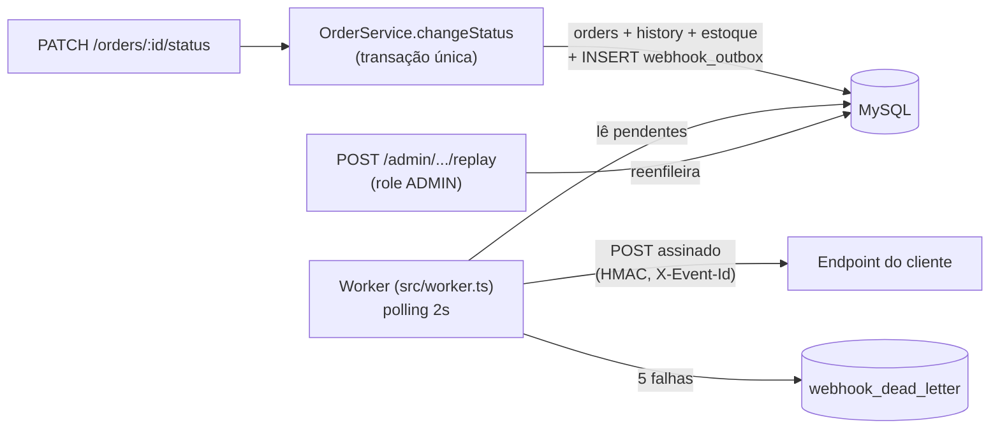

# RFC — Sistema de Webhooks de Notificação de Pedidos

## Metadados

| Campo | Valor |
| --- | --- |
| **Autora** | Larissa (Tech Lead) |
| **Revisores** | Marcos (Product Manager), Bruno (Eng. Pleno — Pedidos), Diego (Eng. Sênior — Plataforma), Sofia (Eng. de Segurança) |
| **Status** | Em revisão |
| **Data** | Elaborado a partir da reunião técnica de quinta-feira, 09:00 (ver [`TRANSCRICAO.md`](../TRANSCRICAO.md)) |
| **Documentos relacionados** | [PRD](PRD.md) · [FDD](FDD.md) · [ADRs](adrs/README.md) |

## Resumo executivo (TL;DR)

Clientes B2B (Atlas Comercial, MaxDistribuição, Nova Cargo) pediram notificação em tempo real (<10s) de mudanças de status de pedidos; hoje eles fazem polling no `GET /orders`, o que é lento e caro — e a Atlas ameaça migrar para o concorrente se não entregarmos até o fim do trimestre.

Propomos **webhooks outbound** construídos sobre a stack existente: **padrão Outbox no MySQL** (evento gravado na mesma transação da mudança de status), **worker em processo Node separado com polling de 2s**, **retry com backoff exponencial em 5 tentativas + DLQ** com replay administrativo, e **assinatura HMAC-SHA256 com secret por endpoint** e rotação com grace period de 24h. Garantia de entrega **at-least-once** com deduplicação pelo header `X-Event-Id`. Nenhuma infraestrutura nova; o módulo segue os padrões atuais da codebase. Estimativa: **3 sprints**, incluindo revisão de segurança.

## Contexto e problema

O OMS controla o ciclo de vida do pedido com máquina de estados (`PENDING → PAID → PROCESSING → SHIPPED → DELIVERED`, com cancelamentos), transação de estoque e auditoria em `order_status_history` — mas **não possui nenhum mecanismo de notificação externa**: sem eventos, filas ou webhooks. A integração dos clientes hoje é puxada (polling em `GET /orders`), o que a torna "lenta e cara" na ponta deles ([09:00] Marcos).

Requisito de negócio: notificação percebida como tempo real — **abaixo de 10 segundos** já atende ([09:02] Marcos). O fluxo é apenas **outbound** (nós → cliente); clientes não enviam webhooks para nós ([09:02] Marcos).

O desafio técnico central: a mudança de status já roda uma transação pesada em `src/modules/orders/order.service.ts` (update de `orders`, insert em `order_status_history`, ajuste de estoque). Não podemos acoplar chamadas HTTP a essa transação, mas também **não pode existir caso em que o status muda e o evento não sai** ([09:40] Bruno).

## Proposta técnica

Visão geral do fluxo (detalhamento de implementação no [FDD](FDD.md)):

1. **Publicação transacional (Outbox)** — na mesma transação SQL da mudança de status, inserimos o evento na nova tabela `webhook_outbox`, com **payload já renderizado (snapshot)** do estado do pedido no instante da transição. Commit da transação ⇒ evento registrado; rollback ⇒ evento some junto. O filtro de interesse é aplicado **na inserção**: se nenhum webhook do customer escuta aquele status, nem inserimos ([09:34] Bruno). — [ADR-001](adrs/ADR-001-padrao-outbox-no-mysql.md), [ADR-007](adrs/ADR-007-snapshot-do-payload-na-insercao.md)

2. **Consumo por worker separado** — nova entry-point `src/worker.ts` (`npm run worker`), mesmo repositório e mesma stack, `PrismaClient` próprio. Polling a cada 2s dos eventos pendentes mais antigos, em batch pequeno. Single-worker nesta fase: ordering garantido por `order_id`, registrado como limitação conhecida. — [ADR-002](adrs/ADR-002-worker-em-processo-separado-com-polling.md)

3. **Resiliência** — timeout de 10s por chamada; falhas passam por retry com backoff exponencial (1m/5m/30m/2h/12h, 5 tentativas, ~15h de janela); esgotadas as tentativas, o evento vai para a tabela `webhook_dead_letter` com payload, motivo e timestamp. Replay manual por endpoint admin (role `ADMIN`, auditado). — [ADR-003](adrs/ADR-003-retry-com-backoff-exponencial-e-dlq.md)

4. **Segurança** — assinatura HMAC-SHA256 do corpo no header `X-Signature`; secret única por endpoint, gerada por nós e devolvida na criação; rotação via API com grace period de 24h; URLs exclusivamente `https` (validação Zod); `X-Timestamp` para detecção de replay pelo cliente. — [ADR-004](adrs/ADR-004-hmac-sha256-com-secret-por-endpoint.md)

5. **Semântica de entrega** — at-least-once com `X-Event-Id` (UUID por evento) para dedup no lado do cliente, padrão de mercado (Stripe, GitHub). — [ADR-005](adrs/ADR-005-entrega-at-least-once-com-x-event-id.md)

6. **Superfície de API** — CRUD de configuração de webhooks (criar, editar, remover, listar por customer) autenticado com JWT normal; histórico de entregas por webhook (`GET /webhooks/:id/deliveries`); rotação de secret; replay de DLQ restrito a `ADMIN`. O `customer_id` vai no body/path — o JWT atual identifica o usuário operador, não o cliente ([09:32] Larissa).

7. **Integração com a codebase** — módulo `src/modules/webhooks` no padrão dos demais; erros `WEBHOOK_*` estendendo `AppError`; Pino, error middleware, schemas Zod e `requireRole` reusados sem alteração; UUID nas novas tabelas. — [ADR-006](adrs/ADR-006-reuso-dos-padroes-existentes-do-projeto.md)

## Alternativas consideradas

| Alternativa | Trade-off que motivou o descarte | Origem |
| --- | --- | --- |
| **Disparo HTTP síncrono dentro do `changeStatus`** | Cliente lento travaria mudanças de status de outros pedidos; cliente fora do ar exigiria rollback de transação de negócio válida. "Síncrono está fora de questão." | [09:04] Bruno, [09:06] Diego |
| **Fila externa (Redis Streams ou similar)** | Infra nova para um time pequeno — "subir Redis Cluster pra isso é overengineering"; outbox no MySQL existente resolve. | [09:07] Larissa, [09:07] Diego |
| **Trigger de banco para acordar o worker** | MySQL não notifica processo externo (sem NOTIFY/LISTEN); seria preciso improvisar. Polling de 2s atende o requisito de <10s com folga. | [09:09] Diego |
| **Garantia exactly-once** | Exigiria coordenação dos dois lados e complexidade muito maior; at-least-once com `event_id` é o padrão de mercado e resolve 99% dos casos. | [09:25] Diego |
| **Secret global da plataforma** | "Se vaza uma, vaza tudo" — secret por endpoint limita o raio de dano e viabiliza rotação isolada. | [09:21] Sofia |
| **Retry em 3 tentativas / retry indefinido** | 3 tentativas matariam eventos em indisponibilidades reais (~2h já observadas); retry infinito deixa evento pendurado para sempre. Meio-termo: 5 tentativas em ~15h. | [09:15]–[09:16] Diego |

## Questões em aberto

1. **Rate limiting de saída** — se um cliente tem 50 pedidos mudando de status em um minuto, hoje receberá 50 chamadas. Decisão adiada: "observar e implementar se virar problema" ([09:38]–[09:39] Diego, Larissa).
2. **Escala para múltiplos workers** — quebra a garantia de ordering por `order_id`; particionamento por `order_id` ou lock pessimista são caminhos possíveis, "problema do futuro" ([09:13] Diego).
3. **Arquivamento da outbox** — linhas entregues devem ser arquivadas depois de ~30 dias, mas isso ficou fora do escopo desta feature ([09:08] Diego).
4. **Endurecimento de permissões no CRUD** — por enquanto qualquer role autenticada gerencia webhooks; "mais pra frente a gente pode endurecer" ([09:36]–[09:37] Sofia).
5. **Notificação proativa de falha ao cliente (email)** — adiada para a próxima fase, depois de medir o impacto ([09:37] Larissa).

## Impacto e riscos

**Impacto no sistema existente:** um único ponto de mudança em código de produção — o `changeStatus` de `src/modules/orders/order.service.ts` passa a chamar uma função `publishWebhookEvent(tx, order, fromStatus, toStatus)` dentro da transação existente ([09:41] Bruno). Todo o resto é adição: módulo novo, tabelas novas, entry-point nova. Middleware de erro, logger e autenticação não mudam ([09:29] Bruno).

**Riscos principais** (análise completa no [PRD](PRD.md) e mitigações técnicas no [FDD](FDD.md)):

- **Falha na inserção da outbox faz rollback da mudança de status** — comportamento desejado para consistência ([09:40] Bruno), mas acopla a disponibilidade da escrita na outbox ao fluxo crítico de pedidos.
- **Cliente indisponível por mais de ~15h** perde a entrega automática e depende de replay manual ([ADR-003](adrs/ADR-003-retry-com-backoff-exponencial-e-dlq.md)).
- **Vazamento de secret pelo cliente** — já aconteceu ([09:22] Diego); mitigado por secret por endpoint e rotação com grace period.
- **Prazo:** Atlas espera para fim de novembro; estimativa de 3 sprints já inclui os 2 dias úteis de revisão de segurança da Sofia ([09:45]–[09:47]).

## Decisões relacionadas

- [ADR-001 — Padrão Outbox no MySQL](adrs/ADR-001-padrao-outbox-no-mysql.md)
- [ADR-002 — Worker em processo separado com polling de 2s](adrs/ADR-002-worker-em-processo-separado-com-polling.md)
- [ADR-003 — Retry com backoff exponencial e DLQ](adrs/ADR-003-retry-com-backoff-exponencial-e-dlq.md)
- [ADR-004 — HMAC-SHA256 com secret por endpoint](adrs/ADR-004-hmac-sha256-com-secret-por-endpoint.md)
- [ADR-005 — Entrega at-least-once com X-Event-Id](adrs/ADR-005-entrega-at-least-once-com-x-event-id.md)
- [ADR-006 — Reuso dos padrões existentes do projeto](adrs/ADR-006-reuso-dos-padroes-existentes-do-projeto.md)
- [ADR-007 — Snapshot do payload na inserção](adrs/ADR-007-snapshot-do-payload-na-insercao.md)
